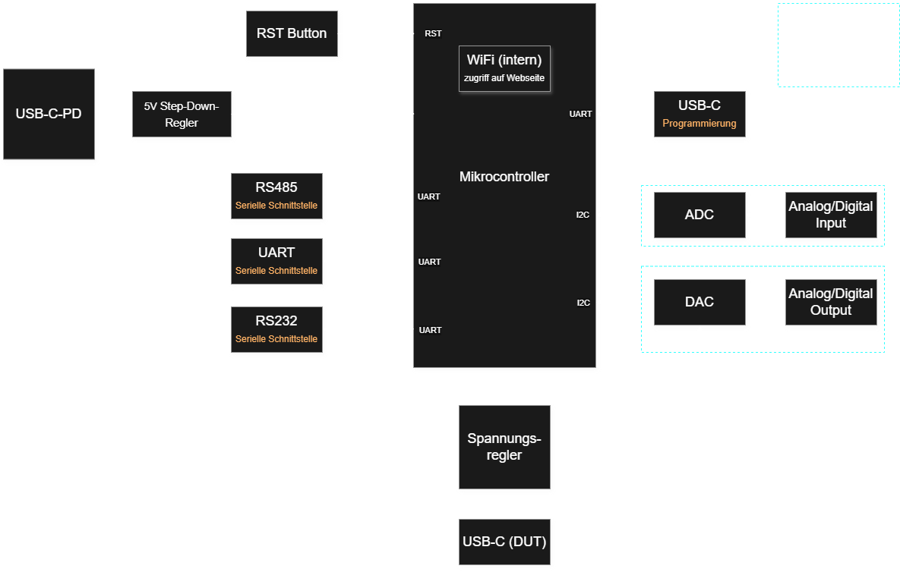
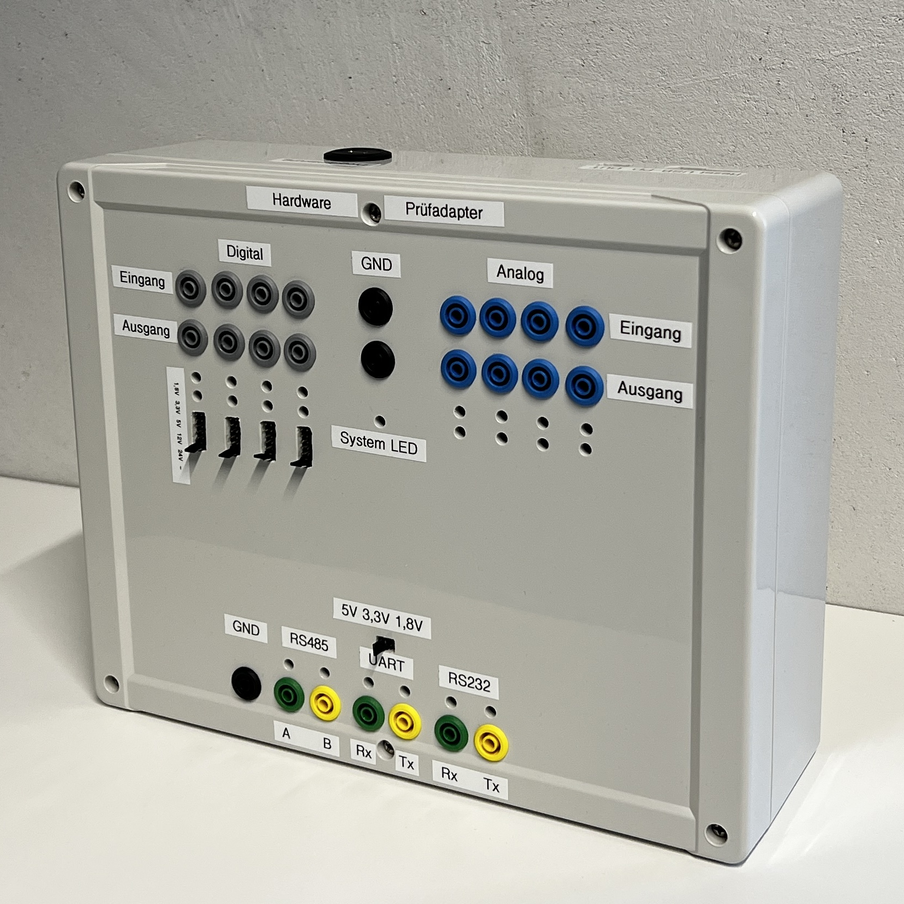

# 🛠️ Hardware Prüfadapter

> **Portfolio-Projekt:** Dieses Repository enthält die vollständige Hard- und Softwareentwicklung eines universellen Hardware-Prüfadapters. Das Projekt entstand als Abschluss-/Technikerprojekt im Rahmen meiner Ausbildung zum staatlich geprüften Techniker Elektrotechnik (Profil: Softwareentwicklung).

---

## 📖 Projektübersicht

Der Hardware Prüfadapter ist ein Embedded-System auf Basis eines ESP32-S3, das entwickelt wurde, um externe Hardwarekomponenten und Baugruppen automatisiert zu testen und zu simulieren. Das System stellt eine Brücke zwischen analoger/digitaler Hardware und modernen Web-Technologien dar.

Das Hauptaugenmerk der Entwicklung lag auf einer **sauberen Systemarchitektur (Clean Architecture)**, extremer Ausfallsicherheit (Fail-Safe-Mechanismen) und einer hohen Testabdeckung durch systemunabhängiges Unit-Testing (TDD).

  

  
  
  

  

## ✨ Kernfunktionen & Features

### 💻 Software
* **Clean Architecture:** Strikte Trennung von Hardware-Treibern (Adaptern) und Business-Logik. Alle Logik-Komponenten sind plattformunabhängig in C++17 geschrieben.
* **Web-Dashboard:** Eine eingebettete Single-Page-Application (HTML/CSS/JS) direkt auf dem Mikrocontroller zur Steuerung und Überwachung der I/Os.
* **RESTful OpenAPI:** Bereitstellung einer API zur Automatisierung sowie Server-Sent Events (SSE) für ein Live-Terminal und Echtzeit-Log-Streaming.

### 🔌 Hardware (KiCad)
* **Herzstück:** ESP32-S3 für Netzwerkkommunikation und Logik.
* **Peripherie über I²C:**
  * ADCs (ADS1115) für Spannungsmessung.
  * DAC (DAC8574) zur Ausgabe analoger Spannung.
  * LED-Treiber (LP5018) für das Status-Feedback direkt am Gerät.
* **Schnittstellen:** UART, RS232, RS485 für externe Gerätekommunikation.

## 🏗️ Software-Architektur

Die Firmware basiert auf dem **EVA-Prinzip** (Eingabe - Verarbeitung - Ausgabe) und läuft in einem deterministischen Zyklus.

1. **Input Sequence:** Auslesen der ADCs, serielle Puffer leeren, asynchrone Befehle aus der Web-API (`Mailbox`) abholen.
2. **Process Sequence:** Abgleich der Daten im `ProcessImager`, Anwenden der Filter, Auswerten der Safety-Regeln (Überspannung, Kurzschluss).
3. **Output Sequence:** Setzen der DACs, Schalten der physikalischen GPIOs, Update der Status-LEDs.

Alle Hardware-Abhängigkeiten werden über Interfaces injiziert (Dependency Injection), wodurch die gesamte Logik auf dem PC simuliert und mit **GoogleTest** geprüft werden kann.

---

## 🛠️ Lokale Entwicklung & Testing

Das Projekt nutzt **PlatformIO** und ein Abstraktions-`Makefile` für reibungslose Entwicklung unter Linux/WSL2 und Windows.